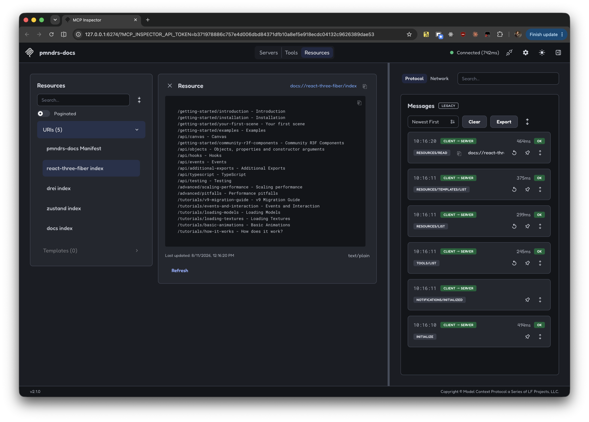

<Intro>
  Every site built with this generator also publishes machine-readable dumps of its content — and [docs.pmnd.rs](https://docs.pmnd.rs) serves them to agents over MCP.
</Intro>

## llms.txt

As alternate content, we provide you [llms.txt](/llms.txt) and [llms-full.txt](/llms-full.txt).

These URLs are linked in the HTML header as:

```html
<link rel="alternate" type="text/plain" href="/llms.txt" />
<link rel="alternate" type="text/plain" href="/llms-full.txt" />
```

## MCP Server

`llms-full.txt` is a whole documentation site in one file — too big to paste into an agent for a one-line question. So [docs.pmnd.rs](https://docs.pmnd.rs) also exposes it as an [MCP](https://modelcontextprotocol.io) server, which lets an agent read a table of contents first, then fetch the one page it needs.

One endpoint for all libraries, over streamable HTTP: `https://docs.pmnd.rs/api/mcp`. It exposes:

| kind     | name                     | what it gives                                                      |
| -------- | ------------------------ | ------------------------------------------------------------------ |
| resource | `docs://pmndrs/manifest` | which libraries are served, and how to query them                  |
| resource | `docs://{lib}/index`     | that library's pages, one `{path} - {title}` per line              |
| tool     | `get_page_content`       | the markdown of a single page, given a `lib` + a `path` from the index |
| resource | `examples://index`       | the [example gallery](https://pmndrs.github.io/examples), one line per demo |
| tool     | `get_example`            | one demo in full, given a `name` from that index                   |

A typical round-trip — *"how do I use TypeScript with Zustand?"*:

```txt
read  docs://zustand/index
      → [...] /learn/guides/beginner-typescript - Beginner TypeScript Guide [...]

call  get_page_content(lib="zustand", path="/learn/guides/beginner-typescript")
      → the page, as markdown
```

Two pages transferred instead of the whole site.

### Examples

The docs say what an API takes. Most three.js questions are *how is this put together*, and the [gallery](https://pmndrs.github.io/examples) has 167 demos that answer it — so the same endpoint serves them, on the same read-the-index-then-fetch shape.

```txt
read  examples://index
      → [...] caustics · #transmission [...]
        diamond-refraction · Diamon refraction material · +postprocessing,leva · #refraction,bvh

call  get_example(name="caustics")
      → the demo: its source, its live URL, its asset attribution, and the exact
        dependency versions the code is written against
```

An index line drops whatever the demo does not carry, so it costs what it is worth. `+` lists only what a demo uses on top of `@react-three/fiber` and `@react-three/drei`, which all of them use. A trailing `~23k` is what `get_example` will cost in tokens — only eight demos carry one, and its absence means the demo is small enough to open without weighing it.

An example is a snapshot, not a spec: it pins its own versions, `get_example` reports them, and an answer that turns on a current signature still belongs in the docs above.

> [!NOTE]
>
> These documents are published, not rendered here — `pmndrs/examples` writes them at build time, at the page URL with an extension on the end:
>
> | | |
> | --- | --- |
> | `/examples/caustics` | the page |
> | `/examples/caustics.md` | the same example, as `get_example` returns it |
> | `/llms.txt` | the whole gallery, as `examples://index` returns it |
>
> Each page links its own, so it is found either by looking or by guessing:
>
> ```html
> <link rel="alternate" type="text/markdown" href="/examples/caustics.md" />
> ```
>
> The demos themselves — `/caustics`, which is what the READMEs' badges point at — carry the same links plus a `canonical` back to the page.
>
> There is no `llms-full.txt`: concatenated, the gallery is ~378k tokens, against ~50k for a documentation site. The index and one example is the whole point.

> [!TIP]
>
> [`pmndrs/claude-code-plugin`](https://github.com/pmndrs/claude-code-plugin) supports it natively
>
> ```sh
> /plugin marketplace add pmndrs/claude-code-plugin
> /plugin install pmndrs@pmndrs
> ```

For other clients, see the JSON config in the [MCP-server](https://docs.pmnd.rs) box on the home page. To poke at it by hand — see the resources, call the tool, read the raw JSON-RPC — run the official inspector:

```sh
$ HOST=127.0.0.1 npx -y @modelcontextprotocol/inspector
```

In the web UI it opens: **Add Servers** › **Add manually**, transport `streamable-http`, URL `https://docs.pmnd.rs/api/mcp` (or your own `http://localhost:3000/api/mcp`), and flip the server's toggle to connect.



### Getting your library served

Only libraries publishing a `/llms-full.txt` dump are served — the ones badged `MCP` on [docs.pmnd.rs](https://docs.pmnd.rs). The examples gallery is not one of them; it publishes its own catalog, and the two resources above are wired to it directly. To join the libraries:

1. **Publish the dump.** If your site is already built with this generator, bump it to a version shipping `/llms-full.txt` and redeploy. Otherwise, either migrate to this generator, or emit that file yourself with the same XML shape (`<page path="…" title="…">…</page>`).

   > [!TIP]
   >
   > With the [reusable workflow](/github-actions/introduction), pin the major tag — it always resolves to the latest `v3.x`:
   >
   > ```yml
   > uses: pmndrs/docs/.github/workflows/build.yml@v3
   > ```
   >
   > `/llms-full.txt` ships since [`v3.2.0`](https://github.com/pmndrs/docs/releases/tag/v3.2.0), in its MCP-ready shape since [`v3.4.1`](https://github.com/pmndrs/docs/releases/tag/v3.4.1).
2. **Check it.** `curl -sI <NEXT_PUBLIC_URL>/llms-full.txt` must return `200`, and the body must contain `<page …>` entries. A missing dump makes the library's index resource fail loudly, on purpose.
3. **Flip the flag.** Open a PR on [pmndrs/docs](https://github.com/pmndrs/docs) setting `llms_full: true` on your entry in `libs` ([`src/app/page.tsx`](https://github.com/pmndrs/docs/blob/main/src/app/page.tsx)). That single flag drives the `MCP` badge, the `docs://{lib}/index` resource and the `get_page_content` enum. It takes effect once [docs.pmnd.rs](https://docs.pmnd.rs) is redeployed — every push to `main` does that.

> [!NOTE]
>
> This is a one-off. Once served, **content** updates need no redeploy on either side: pages are fetched at request time and revalidated every 5 minutes.
