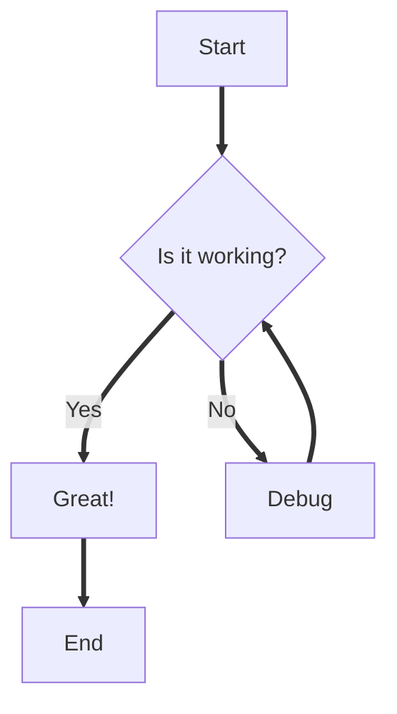
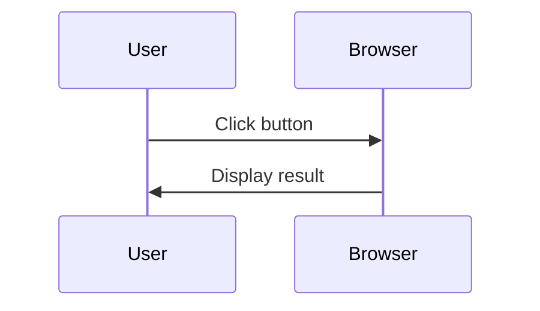

<Intro>
  Text-based diagrams.
</Intro>

[Mermaid](https://mermaid.js.org/) diagrams for flowcharts, sequence diagrams, and other visualizations. Diagrams automatically adapt to light/dark theme.

````md

````

result:


> [!IMPORTANT]
> Due to MDX parser limitations, use <code>==></code> instead of <code>--&gt;</code> for arrows in flowcharts.

---

Sequence diagrams (avoid <code>--&gt;&gt;</code> because it contains <code>--&gt;</code> and will be stripped):

````md

````

result:


