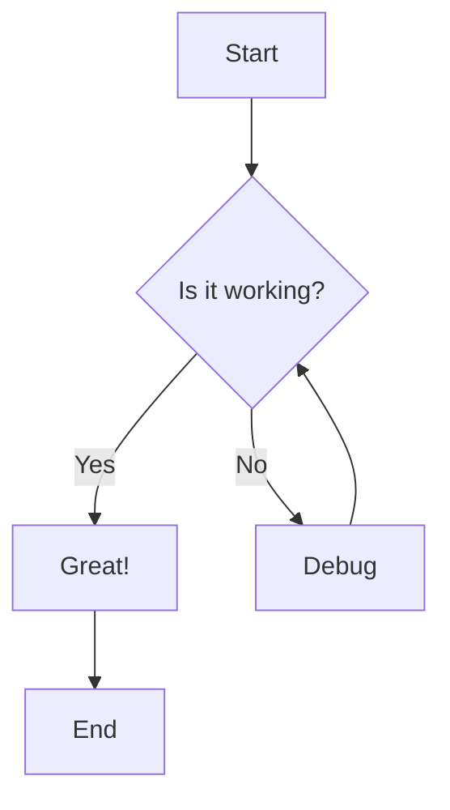
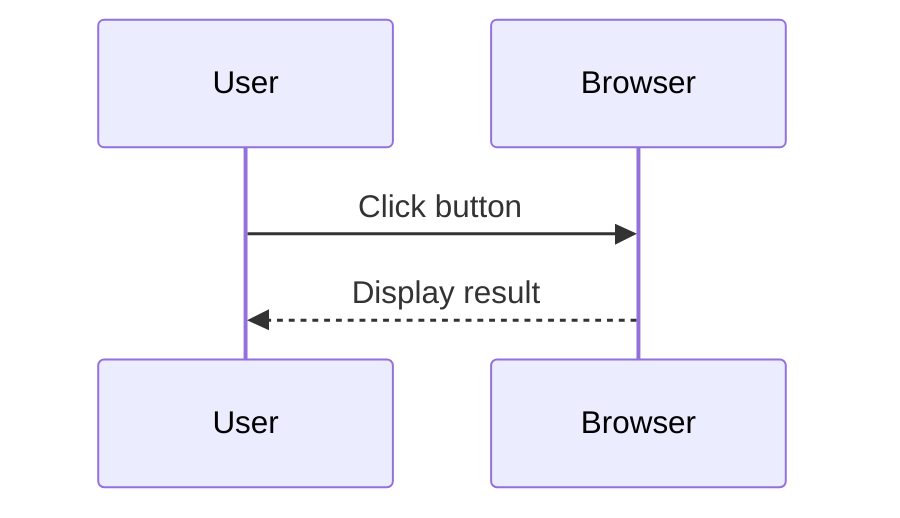
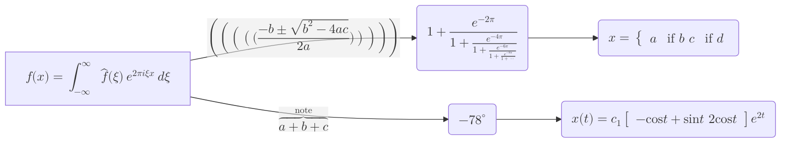

<Intro>
  [Mermaid](https://mermaid.js.org/) text-based diagrams. Automatically adapt to light/dark theme.
</Intro>

````md

````

result:


---

````md

````

result:


---

[KaTeX support](https://github.com/mermaid-js/mermaid/pull/2885):

````md

````

result:

