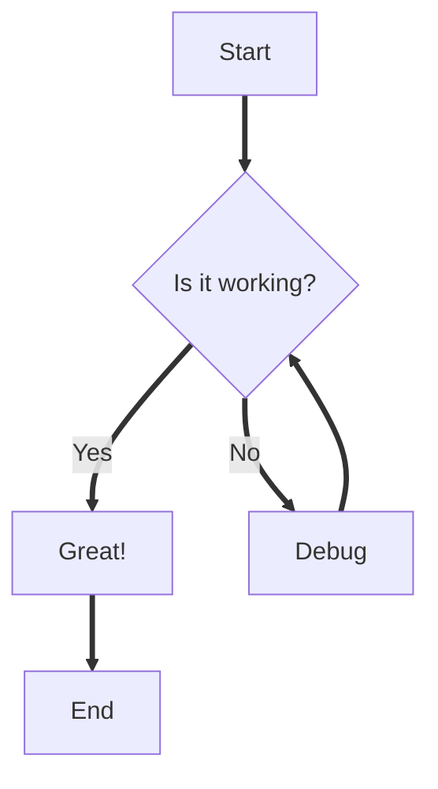
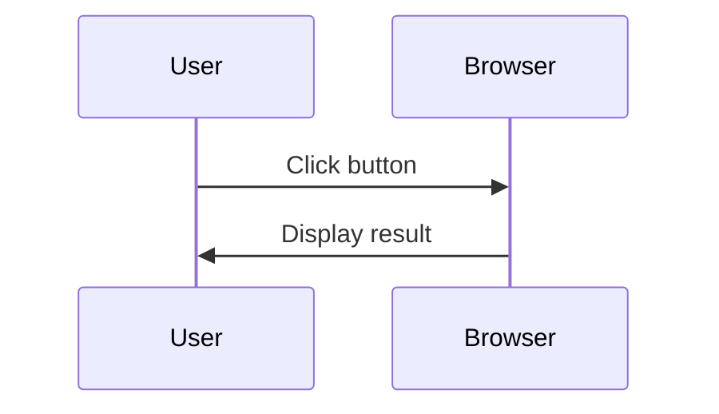

<Intro>
  This is a guide on how to write documentation. We support all [GFM](https://github.github.com/gfm/) syntax, plus some custom components that are described here.
</Intro>

<Keypoints>
  <KeypointsItem>[Front matter](#frontmatter) metadatas</KeypointsItem>
  <KeypointsItem>Custom [markdown](#markdown) components</KeypointsItem>
</Keypoints>

In your `MDX` folder, create any `path/to/my-document.mdx`:

```md
---
title: My Document
description: Lorem ipsum...
nav: 0
image: dog.png
sourcecode: to/my-document.mdx
---

MARKDOWN
```

## Frontmatter

Any key is optional.

- `title`: if not provided, last part of the path is used: `my document`
- `description`
- `sourcecode`: relative path to the source-code file
- `image`:
  - relative (to the md file) or absolute path, eg: `dog.png`, `./dog.png`, `../../dog.png`, `/dog.png` or `https://animals.com/dog.png`
  - will be used as metadata image if provided
- `nav`: order in the navigation (on the same level)

## MARKDOWN

Worth mentioning, you can use **standard HTML**, with [tailwind](https://tailwindcss.com) support:

```md
<div>
  <iframe src="https://drei.pmnd.rs/iframe.html?globals=&args=&id=staging-accumulativeshadows--accumulative-shadow-st&viewMode=story" 
    className="w-full h-60 rounded-lg"
  />
  <p className="mt-1 text-xs text-on-surface-variant">This is an embed iframe of [Drei's `<AccumulativeShadows>` story](https://drei.pmnd.rs/?path=/docs/staging-accumulativeshadows--docs).</p>
</div>
```

<details>
  <summary>Result</summary>

<div>
  <iframe src="https://drei.pmnd.rs/iframe.html?globals=&args=&id=staging-accumulativeshadows--accumulative-shadow-st&viewMode=story" 
    className="w-full h-60 rounded-lg"
  />
  <p className="mt-1 text-xs text-on-surface-variant">This is an embed iframe of [Drei's `<AccumulativeShadows>` story](https://drei.pmnd.rs/?path=/docs/staging-accumulativeshadows--docs).</p>
</div>
</details>

> [!TIP]
>
> We use [react-mcu](https://github.com/abernier/react-mcu) colors, eg: `text-on-surface-variant` above

Plus:
- any [GitHub Flavored Markdown](https://github.github.com/gfm/) syntax.
- all exported [`components/mdx/index.tsx`](components/mdx/index.tsx) MDX components.

### `Intro`

Use at the top of the document, just after the frontmatter.

```md
<Intro>
  This is an intro. Here you can write a long description of the article, longer than the frontmatter `description`, eventually with [links](#), lists, etc.
  
  Multiple paragraphs are also possible, or anything.
</Intro>
```

<details>
  <summary>Result</summary>

<Intro>
  This is an intro. Here you can write a long description of the article, longer than the frontmatter `description`, eventually with [links](#), lists, etc.
  
  Multiple paragraphs are also possible, or anything.
</Intro>
</details>

### `Keypoints`

Can be used after `Intro`, to list main points the article covers: one bullet per `KeypointsItem`.

```md
<Keypoints title="What you'll learn">
  <KeypointsItem>First item</KeypointsItem>
  <KeypointsItem>Second **item**</KeypointsItem>
</Keypoints>
```

<details>
  <summary>Result</summary>

<Keypoints title="What you'll learn">
  <KeypointsItem>First item</KeypointsItem>
  <KeypointsItem>Second **item**</KeypointsItem>
</Keypoints>
</details>

### `Img`

Relative images are supported. Eg, inside your [`MDX`](introduction#configuration:~:text=MDX) folder:
```text {2}
|-- getting-started
|   |-- authoring.mdx  <= relative to this article
|   `-- gutenberg.jpg
```

```md
---
title: Authoring
---


```

<details>
  <summary>Result</summary>


</details>

> [!TIP]
> You are encouraged to use relative images, since dimensions are automatically added as `img[width][height]` attributes.
>
> For others, think about adding them to **prevent layout shift**.

It is also possible to specify only one dimension (other is inferred from instrisic ratio), eg:

```md

```

<details>
  <summary>Result</summary>


</details>

Although it is probably better to use CSS for this:

```md

```

<details>
  <summary>Result</summary>


</details>

> [!NOTE]
> See [`MDX_BASEURL`](introduction#configuration:~:text=MDX_BASEURL) to understand how it is converted to a full URL.

### Code

Line numbers/highlights are supported:

````md
```tsx {1,4-6} showLineNumbers
type Props = {who: string}

function Hi({who}: Props) {
  return (
    <p>Hello, {who}!</p>
  )
}
```
````

<details>
  <summary>Result</summary>

```tsx {1,4-6} showLineNumbers
type Props = {who: string}

function Hi({who}: Props) {
  return (
    <p>Hello, {who}!</p>
  )
}
```

</details>

You can start at a specific `X` line number `showLineNumbers=X`:

````md
```tsx {1,4-6} showLineNumbers=150
type Props = {who: string}

function Hi({who}: Props) {
  return (
    <p>Hello, {who}!</p>
  )
}
```
````

<details>
  <summary>Result</summary>

```tsx {1,4-6} showLineNumbers=150
type Props = {who: string}

function Hi({who}: Props) {
  return (
    <p>Hello, {who}!</p>
  )
}
```

</details>

`diff` format is supported:

````md
```diff
diff --git a/example.txt b/example.txt
index 8c3317a..47ea956 100644
--- a/example.txt
+++ b/example.txt
@@ -1,4 +1,4 @@
-Hello, World!
+Hello, GitHub World!
 Here are some changes:
-This line will be modified.
+This line has been modified.
 This line will stay the same.
```
````

<details>
  <summary>Result</summary>

```diff
diff --git a/example.txt b/example.txt
index 8c3317a..47ea956 100644
--- a/example.txt
+++ b/example.txt
@@ -1,4 +1,4 @@
-Hello, World!
+Hello, GitHub World!
 Here are some changes:
-This line will be modified.
+This line has been modified.
 This line will stay the same.
```

</details>

### Mermaid

[Mermaid](https://mermaid.js.org/) diagrams for flowcharts, sequence diagrams, and other visualizations. Diagrams automatically adapt to light/dark theme.

````md

````

<details>
  <summary>Result</summary>


</details>

> [!IMPORTANT]
> Due to MDX parser limitations, use <code>==></code> instead of <code>--&gt;</code> for arrows in flowcharts.

Sequence diagrams (avoid <code>--&gt;&gt;</code> because it contains <code>--&gt;</code> and will be stripped):

````md

````

<details>
  <summary>Result</summary>


</details>

### `Grid`

Responsive grid.

```md
<Grid cols={2}>
  <li>A</li>
  <li>B</li>
  <li>C</li>
  ...
</Grid>
```

<details>
  <summary>Result</summary>

<Grid cols={2}>
  <li>A</li>
  <li>B</li>
  <li>C</li>
  <li>D</li>
  <li>E</li>
  <li>F</li>
  <li>G</li>
</Grid>

</details>

### `Sandpack`

Inline sandboxes.

> [!NOTE]
> See Sandpack [official documentation](https://sandpack.codesandbox.io/docs/getting-started/usage) for full usage.

```tsx
<Sandpack
  template="react-ts"
  customSetup={{
    dependencies: {
      'three': 'latest',
      '@react-three/fiber': 'latest',
      '@react-three/drei': 'latest'
    },
  }}
  files={{
    '/styles.css': `html,body,#root {height:100%;margin:unset;}`,
    '/App.tsx': `import { Canvas } from '@react-three/fiber'
import { Cloud, CameraControls } from '@react-three/drei'

export default function App() {
  return (
    <Canvas camera={{position: [0,-13,0]}}>
      <Cloud speed={.4} growth={6} />
      <ambientLight intensity={Math.PI} />
      <CameraControls />
    </Canvas>
  )
}`,
  }}
/>
```

<details>
  <summary>Result</summary>

<Sandpack
  template="react-ts"
  customSetup={{
    dependencies: {
      'three': 'latest',
      '@react-three/fiber': 'latest',
      '@react-three/drei': 'latest'
    },
  }}
  files={{
    '/styles.css': `html,body,#root {height:100%;margin:unset;}`,
    '/App.tsx': `import { Canvas } from '@react-three/fiber'
import { Cloud, CameraControls } from '@react-three/drei'

export default function App() {
  return (
    <Canvas camera={{position: [0,-13,0]}}>
      <Cloud speed={.4} growth={6} />
      <ambientLight intensity={Math.PI} />
      <CameraControls />
    </Canvas>
  )
}`,
  }}
/>

> [!TIP]
> Sandpack UI SSR-rendering[^1] is also supported (out of the box).

[^1]: https://sandpack.codesandbox.io/docs/guides/ssr#nextjs-app-dir  

</details>

#### `Sandpack[folder]`

Instead of `files`, a `folder` prop allow you to pass a folder containing all the files:

```tsx
<Sandpack
  template="react-ts"
  folder="authoring-sandpack-cloud"
/>
```

`folder` path is relative to the `.mdx` file:

```text
|-- getting-started
|   |-- authoring.mdx             <= relative to this article
|   `-- authoring-sandpack-cloud  <= the folder
```

> [!TIP]
> It will simply:
> - build the `files` prop for you (including all `.{js|ts|jsx|tsx|css}` it finds)
> - build `customSetup.dependencies` from `package.json` if it exists

<details>
  <summary>Result</summary>

<Sandpack
  template="react-ts"
  folder="authoring-sandpack-cloud"
/>

</details>

It is also possible to pass some individual [file format](https://sandpack.codesandbox.io/docs/getting-started/usage#file-format) configuration:

```tsx
<Sandpack
  template="react-ts"
  folder="authoring-sandpack-cloud"
  files={{
    '/App.tsx': {
      readOnly: true,
      active: true,
    },
    '/styles.css': {
      hidden: true
    }
  }}
/>
```

<details>
  <summary>Result</summary>

<Sandpack
  template="react-ts"
  folder="authoring-sandpack-cloud"
  files={{
    '/App.tsx': {
      readOnly: true,
      active: true,
    },
    '/styles.css': {
      hidden: true
    }
  }}
/>

</details>

#### `Sandpack[fileExplorer]`

```tsx
<Sandpack
  template="react-ts"
  folder="authoring-sandpack-cloud"
  fileExplorer
/>
```

<details>
  <summary>Result</summary>

<Sandpack
  template="react-ts"
  folder="authoring-sandpack-cloud"
  fileExplorer
/>

</details>

> [!TIP]
> Conveniently, enabling `fileExplorer` will by default `[codeEditor={showTabs: false}]`.
> You can override it with [`[codeEditor]` options](#sandpack[codeeditor])

You can also pass [any `fileExplorer={options: ComponentProps<SandpackFileExplorer>}`](https://sandpack.codesandbox.io/docs/advanced-usage/components#file-explorer:~:text=Preview-,Options,-If%20you%27re%20looking).

#### `Sandpack[codeEditor]`

You can pass [any `codeEditor={options: ComponentProps<SandpackCodeEditor>}`](https://sandpack.codesandbox.io/docs/advanced-usage/components#code-editor:~:text=Preview-,Options,-Extensions).

#### `Sandpack[codeViewer]`

It will render the [`SandpackCodeViewer`](https://sandpack.codesandbox.io/docs/advanced-usage/components#code-viewer) instead of the default [`SandpackCodeEditor`](https://sandpack.codesandbox.io/docs/advanced-usage/components#code-editor).

```tsx
<Sandpack
  template="react-ts"
  folder="authoring-sandpack-cloud"
  codeViewer
/>
```

<details>
  <summary>Result</summary>

<Sandpack
  template="react-ts"
  folder="authoring-sandpack-cloud"
  codeViewer
/>

</details>

You can also pass [any `codeViewer={options: ComponentProps<SandpackCodeViewer>}`](https://sandpack.codesandbox.io/docs/advanced-usage/components#code-viewer:~:text=Preview-,Options,-CodeMirror%20decorations).

##### `Sandpack[codeViewer][filesDecorators]`

You can define per-file [decorators](https://sandpack.codesandbox.io/docs/advanced-usage/components#codemirror-decorations) through `filesDecorators` prop:

```tsx
<Sandpack
  template="react-ts"
  folder="authoring-sandpack-cloud"
  codeViewer={{
    filesDecorators: {
      '/App.tsx': [
        { className: "highlight", line: 1 },
        { className: "highlight", line: 7 },
        {
          className: "widget",
          elementAttributes: { "data-id": "1" },
          line: 7,
          startColumn: 13,
          endColumn: 24,
        },
        {
          className: "widget",
          elementAttributes: { "data-id": "2" },
          line: 7,
          startColumn: 25,
          endColumn: 35,
        },
        
      ],
      '/styles.css': [
        { className: "highlight", line: 4 },
      ]
    }
  }}
/>
```

<details>
  <summary>Result</summary>

<Sandpack
  template="react-ts"
  folder="authoring-sandpack-cloud"
  codeViewer={{
    filesDecorators: {
      '/App.tsx': [
        { className: "highlight", line: 1 },
        { className: "highlight", line: 7 },
        {
          className: "widget",
          elementAttributes: { "data-id": "1" },
          line: 7,
          startColumn: 13,
          endColumn: 24,
        },
        {
          className: "widget",
          elementAttributes: { "data-id": "2" },
          line: 7,
          startColumn: 25,
          endColumn: 35,
        },
        
      ],
      '/styles.css': [
        { className: "highlight", line: 4 },
      ]
    }
  }}
/>

</details>

#### `Sandpack[preview]`

You can pass [any `preview={options: ComponentProps<SandpackPreview>}`](https://sandpack.codesandbox.io/docs/advanced-usage/components#preview:~:text=Preview-,Options,-Additional%20buttons).

### `Codesandbox`

```md
<Codesandbox id="3rjsl" />
```

<details>
  <summary>Result</summary>

<Codesandbox id="3rjsl" />

</details>

### `Gha`

Aka. ["GitHub alerts"](https://github.com/orgs/community/discussions/16925)

```md
<Gha keyword="NOTE">Highlights information that users should take into account, even when skimming.</Gha>
```

or better:

```md
> [!NOTE]
> Highlights information that users should take into account, even when skimming.
```

<details>
  <summary>Result</summary>

> [!NOTE]
> Highlights information that users should take into account, even when skimming.

</details>

<details>
  <summary>We also support: `[!TIP]`, `[!IMPORTANT]`, `[!WARNING]`, `[!CAUTION]`</summary>

> [!TIP]
> Optional information to help a user be more successful.

> [!IMPORTANT]
> Crucial information necessary for users to succeed.

> [!WARNING]
> Critical content demanding immediate user attention due to potential risks.

> [!CAUTION]
> Negative potential consequences of an action.

</details>

### `Hint`

> [!CAUTION]
> Deprecated, use [`Gha[keyword="NOTE"]`](#Gha) instead.

```md
<Hint>
  I'm a deprecated hint. Use `Gha` instead.
</Hint>
```

<details>
  <summary>Result</summary>

<Hint>I'm a deprecated hint. Use `Gha` instead.</Hint>

</details>

### `Contributors`

```md
<Contributors owner="pmndrs" repo="docs" />
```

> [!WARNING]
> [`CONTRIBUTORS_PAT`](introduction#configuration:~:text=CONTRIBUTORS_PAT) needs to be set. Otherwise, it will display John Doe.

<details>
  <summary>Result</summary>

<Contributors owner="pmndrs" repo="docs" />

</details>

### Backers

```md
<Backers repo="react-three-fiber" />
```

<details>
  <summary>Result</summary>

<Backers repo="react-three-fiber" />

</details>

### `Entries`

Displays all documentation pages grouped by their top-level category (first part of the slug). Each entry shows the page title with links to associated CodeSandbox examples.

```md
<Entries />
```

<details>
  <summary>Result</summary>

<Entries />

</details>

You can exclude specific groups from the listing:

```md
<Entries excludedGroups={['getting-started', 'examples']} />
```

> [!NOTE]
> The `Entries` component automatically receives all documentation pages from the system. It groups them by the first segment of their URL path (e.g., 'getting-started', 'tutorials', etc.).
