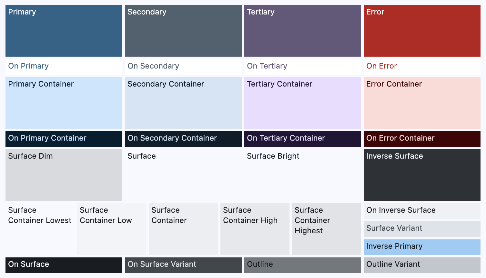

<Intro>
  A static MDX documentation generator, with a GitHub [reusable workflow](./github-actions.mdx). It is primarily used for some `pmndrs/*` projects, but will work for anyone.
</Intro>


[Those projects](https://github.com/search?q=%22uses%3A+pmndrs%2Fdocs%2F.github%2Fworkflows%2Fbuild.yml%22+language%3AYAML&type=code&l=YAML) are known to be using this generator.

## INSTALL

Pre-requisites:

- Install [nvm](https://github.com/nvm-sh/nvm), then:
  ```sh
  $ nvm install
  $ nvm use
  $ node -v # make sure your version satisfies package.json#engines.node
  ```
  nb: if you want this node version to be your default nvm's one:
  `nvm alias default node`

```sh
$ git clone https://github.com/pmndrs/docs.git
$ cd docs
$ pnpm install
```

## Configuration

> [!IMPORTANT]
>
> Default value is always: `""` (think *empty*).

| var                                   | description                                                                                                                                                              | example                                                                                          |
| ------------------------------------- | ------------------------------------------------------------------------------------------------------------------------------------------------------------------------ | ------------------------------------------------------------------------------------------------ |
| `MDX`\*                               | Path to `*.mdx` folder<br/>NB: can be relative or absolute                                                                                                               | `docs` or `~/code/myproject/documentation`                                                       |
| `NEXT_PUBLIC_LIBNAME`\*               | Library name                                                                                                                                                             | `React Three Fiber`                                                                              |
| `NEXT_PUBLIC_LIBNAME_SHORT`           | Library short name                                                                                                                                                       | `r3f`                                                                                            |
| `NEXT_PUBLIC_LIBNAME_DOTSUFFIX_LABEL` | Text for the ".docs" suffix link inside the header                                                                                                                       | `docs`                                                                                           |
| `NEXT_PUBLIC_LIBNAME_DOTSUFFIX_HREF`  | Href for the ".docs" suffix link inside the header                                                                                                                       | `https://docs.pmnd.rs`                                                                          |
| `BASE_PATH`                           | Base path for the final URL                                                                                                                                              | `/react-three-fiber`                                                                             |
| `DIST_DIR`                            | Path to the output folder ([within project](https://nextjs.org/docs/app/api-reference/next-config-js/distDir#:~:text=should%20not%20leave%20your%20project%20directory)) | `out` or `docs/out/react-three-fiber`                                                            |
| `OUTPUT`                              | Set to `export` for static output                                                                                                                                        | `export`                                                                                         |
| `HOME_REDIRECT`                       | Where the home should redirect                                                                                                                                           | `/getting-started/introduction`                                                                  |
| `MDX_BASEURL`                         | Base URL for inlining relative images                                                                                                                                    | `http://localhost:60141`or `https://github.com/pmndrs/react-three-fiber/raw/master/docs`         |
| `SOURCECODE_BASEURL`                  | Base URL for `sourcecode:` code path                                                                                                                                     | `https://github.com/pmndrs/react-three-fiber/tree/main`                                          |
| `EDIT_BASEURL`                        | Base URL for displaying "Edit this page" URLs                                                                                                                            | `https://github.com/pmndrs/react-three-fiber/edit/master/docs`                                   |
| `NEXT_PUBLIC_URL`                     | Final URL of the published website                                                                                                                                       | `https://pmndrs.github.io/react-three-fiber`                                                     |
| `ICON`                                | Emoji or image to use as (fav)icon (path local to `MDX`)                                                                                                                 | `🇨🇭` or `/icon.png` or `/favicon.ico`                                                            |
| `LOGO`                                | Logo src/path (either FQURL or local to `MDX` path)                                                                                                                      | `/logo.png` or `https://worldvectorlogo.com/r3f.png`                                             |
| `GITHUB`                              | Github URL                                                                                                                                                               | `https://github.com/pmndrs/react-three-fiber`                                                    |
| `DISCORD`                             | Discord URL                                                                                                                                                              | `https://discord.com/channels/740090768164651008/740093168770613279`                             |
| `THEME_PRIMARY`                       | Primary accent color                                                                                                                                                     | `#323e48`                                                                                        |
| `THEME_SCHEME`                        | Theme scheme                                                                                                                                                             | `content` or `expressive` or `fidelity` or `monochrome` or `neutral` or `tonalSpot` or `vibrant` |
| `THEME_CONTRAST`                      | Theme contrast -- value between -1 and 1                                                                                                                                 | `0` or `-1` or `1` or `-.6`                                                                      |
| `THEME_NOTE`                          | "note" color                                                                                                                                                             | `#1f6feb`                                                                                        |
| `THEME_TIP`                           | "tip" color                                                                                                                                                              | `#238636`                                                                                        |
| `THEME_IMPORTANT`                     | "important" color                                                                                                                                                        | `#8957e5`                                                                                        |
| `THEME_WARNING`                       | "warning" color                                                                                                                                                          | `#d29922`                                                                                        |
| `THEME_CAUTION`                       | "caution" color                                                                                                                                                          | `#da3633`                                                                                        |
| `CONTRIBUTORS_PAT`                    | GitHub token for contributors API (see: https://docs.github.com/en/rest/collaborators/collaborators?apiVersion=2022-11-28#list-repository-collaborators)                 | `ghp_1234567890`                                                                                 |

\* Required

<details>
  <summary>`MDX_BASEURL`</summary>

Given a `advanced/introduction.mdx` file in the `MDX` folder:

```md

```

becomes (for a `MDX_BASEURL=http://localhost:60141` value):

```md

```

`http://localhost:60141` being the `MDX` folder served.

> [!TIP]
> When deployed on GitHub Pages, `MDX_BASEURL` will typically value something like `https://github.com/pmndrs/uikit/raw/main/docs`, thanks to [`build.yml`](.github/workflows/build.yml) rule.

</details>

<details>
  <summary>`THEME_*`</summary>

We implement [m3 design system](https://m3.material.io/styles/color/system/overview), using [react-mcu](https://github.com/abernier/react-mcu).

[](https://github.com/abernier/react-mcu)

> [!NOTE]
> - [Material Color](https://www.youtube.com/playlist?list=PLsoLz-E4Os4WWkrvRuQ7BJuVF-WfOyfWT) for more information
> - We currently don't have secondary/tertiary colors (maybe some day).

</details>

## dev

```sh
$ (
  trap 'kill -9 0' SIGINT

  export _PORT=60141

  export MDX=docs
  export NEXT_PUBLIC_LIBNAME="Poimandres"
  export NEXT_PUBLIC_LIBNAME_SHORT="pmndrs"
  export NEXT_PUBLIC_LIBNAME_DOTSUFFIX_LABEL="docs"
  export NEXT_PUBLIC_LIBNAME_DOTSUFFIX_HREF="https://docs.pmnd.rs"
  export BASE_PATH=
  export DIST_DIR=
  export OUTPUT=export
  export HOME_REDIRECT=
  export MDX_BASEURL=http://localhost:$_PORT
  export SOURCECODE_BASEURL="vscode://file$(pwd)"
  export EDIT_BASEURL="vscode://file$(pwd)/docs"
  export NEXT_PUBLIC_URL=
  export ICON=
  export LOGO=gutenberg.jpg
  export GITHUB=https://github.com/pmndrs/docs
  export DISCORD=https://discord.com/channels/740090768164651008/1264328004172255393
  export THEME_PRIMARY="#323e48"
  export THEME_SCHEME="tonalSpot"
  export THEME_CONTRAST="0"
  export THEME_NOTE="#1f6feb"
  export THEME_TIP="#238636"
  export THEME_IMPORTANT="#8957e5"
  export THEME_WARNING="#d29922"
  export THEME_CAUTION="#da3633"
  export CONTRIBUTORS_PAT=

  kill $(lsof -ti:"$_PORT")
  npx serve $MDX -p $_PORT --no-port-switching --no-clipboard &

  pnpm run dev &

  wait
)
```

Then go to: http://localhost:3000

> [!TIP]
> If `HOME_REDIRECT=` empty, `/` will not redirect, and instead displays an index of libraries.

## build

```sh
$ (
  trap 'kill -9 0' SIGINT

  rm -rf out

  export _PORT=60141

  export MDX=docs
  export NEXT_PUBLIC_LIBNAME="Poimandres"
  export NEXT_PUBLIC_LIBNAME_SHORT="pmndrs"
  export NEXT_PUBLIC_LIBNAME_DOTSUFFIX_LABEL="docs"
  export NEXT_PUBLIC_LIBNAME_DOTSUFFIX_HREF="https://docs.pmnd.rs"
  export BASE_PATH=
  export DIST_DIR=
  export OUTPUT=export
  export HOME_REDIRECT=/getting-started/introduction
  export MDX_BASEURL=http://localhost:$_PORT
  export SOURCECODE_BASEURL=
  export EDIT_BASEURL=
  export NEXT_PUBLIC_URL=
  export ICON=
  export LOGO=gutenberg.jpg
  export GITHUB=https://github.com/pmndrs/docs
  export DISCORD=https://discord.com/channels/740090768164651008/1264328004172255393
  export THEME_PRIMARY="#323e48"
  export THEME_SCHEME="tonalSpot"
  export THEME_CONTRAST="0"
  export THEME_NOTE="#1f6feb"
  export THEME_TIP="#238636"
  export THEME_IMPORTANT="#8957e5"
  export THEME_WARNING="#d29922"
  export THEME_CAUTION="#da3633"
  export CONTRIBUTORS_PAT=

  pnpm run build

  kill $(lsof -ti:"$_PORT")
  npx serve $MDX -p $_PORT --no-port-switching --no-clipboard &

  npx serve out &

  wait
)
```

http://localhost:3000

## Docker

```sh
$ docker build -t pmndrs-docs .
```

```sh
$ cd ~/code/pmndrs/react-three-fiber
$ (
  trap 'kill -9 0' SIGINT

  export _PORT=60141

  export MDX=docs
  export NEXT_PUBLIC_LIBNAME="React Three Fiber"
  export NEXT_PUBLIC_LIBNAME_SHORT="r3f"
  export NEXT_PUBLIC_LIBNAME_DOTSUFFIX_LABEL="docs"
  export NEXT_PUBLIC_LIBNAME_DOTSUFFIX_HREF="https://docs.pmnd.rs"
  export BASE_PATH=/toto
  export DIST_DIR="$MDX/out$BASE_PATH"
  export OUTPUT=export
  export HOME_REDIRECT=/getting-started/introduction
  export MDX_BASEURL=http://localhost:$_PORT
  export SOURCECODE_BASEURL=
  export EDIT_BASEURL=
  export NEXT_PUBLIC_URL=
  export ICON=🇨🇭
  export LOGO=/logo.png
  export GITHUB=https://github.com/pmndrs/react-three-fiber
  export DISCORD=https://discord.com/channels/740090768164651008/740093168770613279
  export THEME_PRIMARY="#323e48"
  export THEME_SCHEME="tonalSpot"
  export THEME_CONTRAST="0"
  export THEME_NOTE="#1f6feb"
  export THEME_TIP="#238636"
  export THEME_IMPORTANT="#8957e5"
  export THEME_WARNING="#d29922"
  export THEME_CAUTION="#da3633"
  export CONTRIBUTORS_PAT=

  rm -rf "$MDX/out"

  docker run --rm --init -it \
    -v "./$MDX":/app/docs \
    -e MDX \
    -e NEXT_PUBLIC_LIBNAME \
    -e NEXT_PUBLIC_LIBNAME_SHORT \
    -e NEXT_PUBLIC_LIBNAME_DOTSUFFIX_LABEL \
    -e NEXT_PUBLIC_LIBNAME_DOTSUFFIX_HREF \
    -e BASE_PATH \
    -e DIST_DIR \
    -e OUTPUT \
    -e HOME_REDIRECT \
    -e MDX_BASEURL \
    -e SOURCECODE_BASEURL \
    -e EDIT_BASEURL \
    -e NEXT_PUBLIC_URL \
    -e ICON \
    -e LOGO \
    -e GITHUB \
    -e DISCORD \
    -e THEME_PRIMARY \
    -e THEME_SCHEME \
    -e THEME_CONTRAST \
    -e THEME_NOTE \
    -e THEME_TIP \
    -e THEME_IMPORTANT \
    -e THEME_WARNING \
    -e THEME_CAUTION \
    -e CONTRIBUTORS_PAT \
    pmndrs-docs pnpm run build

  kill $(lsof -ti:"$_PORT")
  npx serve $MDX -p $_PORT --no-port-switching --no-clipboard &

  npx -y serve "$MDX/out" &

  wait
)
```

Then go to: http://localhost:3000

## Agents

As alternate content, we provide you [llms.txt](/llms.txt) and [llms-full.txt](/llms-full.txt).

These URLs are linked in the HTML header as:

```html
<link rel="alternate" type="text/plain" href="/llms.txt" />
<link rel="alternate" type="text/plain" href="/llms-full.txt" />
```

## MCP Server

The documentation is also accessible via a [Model Context Protocol (MCP)](https://modelcontextprotocol.io) server at the `/mcp` endpoint. This enables AI agents to surgically query specific documentation pages without downloading entire sites.

### Usage

Connect to the MCP server at `https://docs.pmnd.rs/mcp`:

```bash
# Direct connection (Streamable HTTP)
curl https://docs.pmnd.rs/mcp

# For stdio-only clients, use mcp-remote
npx -y mcp-remote https://docs.pmnd.rs/mcp
```

### AI Agent Configuration

Configure AI agents to use the MCP server:

```json
{
  "mcpServers": {
    "pmndrs": {
      "url": "https://docs.pmnd.rs/mcp",
      "transport": "sse"
    }
  }
}
```

### Available Tools

The server exposes two tools:

- **`list_pages(lib)`** - Lists all available documentation paths for a library
- **`get_page_content(lib, path)`** - Retrieves the full content of a specific page

Supported libraries: react-three-fiber, react-spring, drei, zustand, jotai, valtio, a11y, react-postprocessing, uikit, xr, prai, viverse, leva