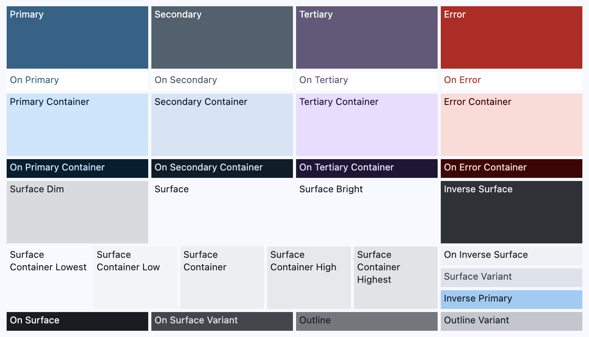

<Intro>
  A static MDX documentation generator, with a GitHub [reusable workflow](./github-actions.mdx). It is primarily used for some `pmndrs/*` projects, but will work for anyone.
</Intro>


[Those projects](https://github.com/search?q=%22uses%3A+pmndrs%2Fdocs%2F.github%2Fworkflows%2Fbuild.yml%22+language%3AYAML&type=code&l=YAML) are known to be using this generator.

## INSTALL

Nothing to install to use it — every command below runs through `npx`. Working on the generator
itself is the one case that needs a checkout:

```sh
$ git clone https://github.com/pmndrs/docs.git
$ cd docs
$ nvm use && pnpm install
```

## Configuration

Every option is a flag, the environment variable it falls back to, or a line of a `.env` read
from the folder the command runs in — a flag beats the environment, which beats the file, and
everything defaults to empty. `pmndrs-docs dev --help` prints these same rows, which is where
they are declared:

<WebsiteOptions />

`MDX` is the folder itself, the `IN` argument of every command. `CONTRIBUTORS_PAT` has no flag:
it is a [GitHub token](https://docs.github.com/en/rest/collaborators/collaborators) for the
contributors API, and belongs in CI rather than in a file.

```sh
# .env
MDX=docs                                    # the folder of *.mdx, relative or absolute
NEXT_PUBLIC_LIBNAME=React Three Fiber       # the name in the header
NEXT_PUBLIC_LIBNAME_SHORT=r3f
BASE_PATH=/react-three-fiber
HOME_REDIRECT=/getting-started/introduction
MDX_BASEURL=https://github.com/pmndrs/react-three-fiber/raw/master/docs
SOURCECODE_BASEURL=https://github.com/pmndrs/react-three-fiber/tree/main
EDIT_BASEURL=https://github.com/pmndrs/react-three-fiber/edit/master/docs
ICON=🇨🇭
LOGO=/logo.png
GITHUB=https://github.com/pmndrs/react-three-fiber
THEME_PRIMARY="#323e48"                     # quoted, or `#` starts a comment
THEME_SCHEME=tonalSpot
```

`MDX` and `NEXT_PUBLIC_LIBNAME` are the two required ones.

<details>
  <summary>`MDX_BASEURL`</summary>

Relative images are resolved against it, so `` in `advanced/introduction.mdx`
becomes ``. `build.yml` points it at the raw files of the branch
being built; `dev` points it at the MDX folder it serves itself.

</details>

<details>
  <summary>`THEME_*`</summary>

We implement [m3 design system](https://m3.material.io/styles/color/system/overview), using [material-theme-builder](https://github.com/abernier/material-theme-builder).

[](https://github.com/abernier/material-theme-builder)

> [!NOTE]
> - [Material Color](https://www.youtube.com/playlist?list=PLsoLz-E4Os4WWkrvRuQ7BJuVF-WfOyfWT) for more information
> - We currently don't have secondary/tertiary colors (maybe some day).

</details>

## Usage

### dev

```sh
$ npx -y @pmndrs/docs@latest dev docs \
  --libname "React Three Fiber" \
  --libname-short "r3f" \
  --home-redirect /getting-started/introduction \
  --icon 🇨🇭 \
  --github https://github.com/pmndrs/react-three-fiber
```

Then go to: http://localhost:3000

Pages are read on every request — edit one, reload. The `MDX` folder is served alongside, so
relative images resolve as you write them, and `--port` moves the server.

> [!TIP]
> If `--home-redirect` is left empty, `/` will not redirect, and instead displays an index of libraries.

With the options in a [`.env`](#Configuration), there is nothing left to pass:

```sh
$ npx -y @pmndrs/docs@latest dev
```

### build

```sh
$ npx -y @pmndrs/docs@latest build docs out --format website \
  --libname "React Three Fiber" \
  --icon 🇨🇭
$ npx -y serve out
```

`--format website` statically exports the whole site into `out` — what
[`build.yml`](./github-actions.mdx) publishes to GitHub Pages. `--format fragment` (the default)
compiles one `.html` per `.mdx` instead: the compiled MDX and nothing else, no layout, no
stylesheet, no script.

## Agents

`llms.txt` dumps and the pmndrs MCP server moved to their own page: [Agents](/agents/introduction).
